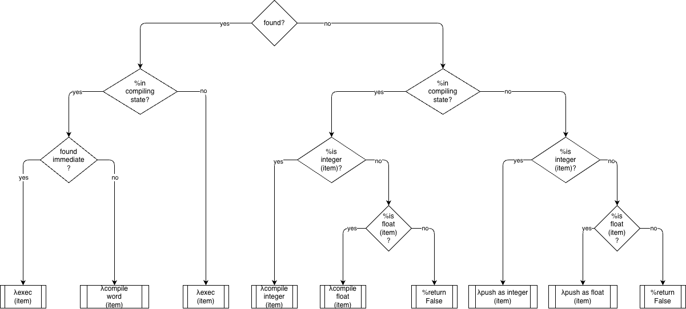

# Simple Forth written in a portable meta-language (frish)

Forth written in file [forthish.frish.inc](forthish.frish.inc), using the meta-language `frish` (very similar to Python).

Uses a diagram to specify one routine. The diagram is `xinterpret.drawio`. 

The diagram is transmogrified to python using the dtree tool resulting in `xinterpret.frish`

`M4` is used to include `xinterpret.frish` into `forthish.frish.m4` resulting in `forthish.frish`.

`Forthish.frish` is then transmogrified into runnable [python code](forthish.py) via `frish.drawio`.

Run `forthish.py` --> forth REPL on the command line.

repo: https://github.com/guitarvydas/frish
